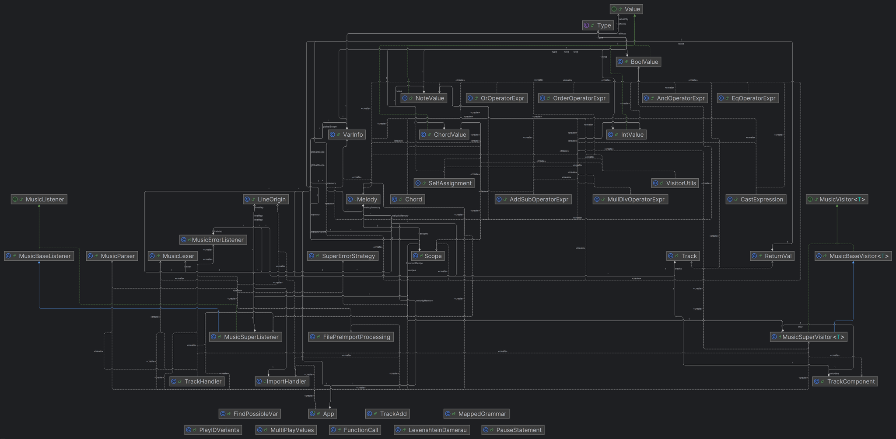
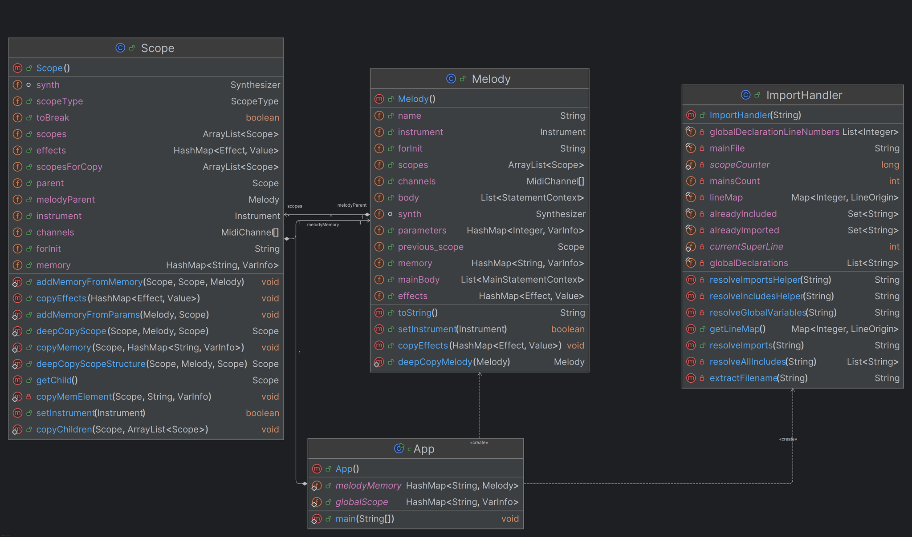

# Technical Description of the CFlat Language Interpreter

## Grammar Construction

The grammar of the CFlat language was defined using the [ANTLR4](https://www.antlr.org/) tool.  
It can be found in the repository [here](src/main/java/pl/edu/agh/grammar/Music.g4).  
Below is a description of the main assumptions and structure of this grammar.

---

### 1. Program Structure

The basic program skeleton:

- **includes** – `include` directives for importing libraries.
- **imports** – imports of external files.
- **globalVars** – declarations of global variables.
- **functionDecl** – function (melody) declarations.
- **mainDecl** – the main program function (`melody main`).

---
### 2. Declarations and Statements

- **Global and local variables** are declared by the `varDecl` rule.
- **Functions** (melodies) are declared by `functionDecl`.
- **Parameters** of functions are described by the `parameters` rule.
- **Types** supported by the language: `int`, `bool`, `Chord`, `Note`.

---

### 3. Main Statements

The language supports, among others:

- Assignments (`assignment`, `selfAssignment`)
- Variable declarations (`varDecl`)
- Playing notes and chords (`playStatement`)
- Pauses (`pauseStatement`)
- Musical parameter settings (`settings`)
- Control statements: loops (`loop`), conditionals (`if`, `elseif`, `else`), blocks (`scope`)
- Function calls (`functionCall`)
- Console output (`print`)
- Special instructions: `break`, `continue`, `return`

---

### 4. Musical Settings

Using the `SET` instruction, playback parameters can be modified, such as tempo (`PACE`), instrument (`INSTRUMENT`), volume (`VOLUME`), effects (`REVERB`, `TREMOLO`, etc.).

---

### 5. Handling Notes, Chords, and Tracks

- Notes are represented by `NOTE_VAL` (e.g., `C4`, `D#3`).
- Chords are written in square brackets, e.g., `[C4,E4,G4]`.
- Tracks can only be declared from the main scope of the main function.

---

### 6. Expressions

The language supports standard arithmetic, logical, and comparison expressions, type casting, and operations on custom types (`Chord`, `Note`).

---

### 7. Keywords and Values Syntax

- **Keywords**: `import`, `include`, `melody`, `int`, `bool`, `Chord`, `Note`, `Track`, `SET`, `PLAY`, `PAUSE`, `RETURN`, `PRINT`, `break`, `continue`, `while`, `for`, `if`, `else`, etc.
- **Values**: integers (`INT_VAL`), boolean values (`true`, `false`), notes (`NOTE_VAL`), instrument names (`INSTRUMENT_VALUE`).

---

### 9. Comments

- Single-line comments: `// comment`
- Block comments: `/* comment */`
---

### 10. Extensibility

Thanks to the modular grammar structure, it is easy to add new types, statements, and keywords.

## Two-Pass Interpreter Operation

The interpreter operates in two stages:

1. **First Pass — Listener:**
    - After parsing the code, the interpreter runs a **listener** that traverses the parse tree.
    - In this stage:
        - **Variables are registered**: global and local within scopes in `HashMap` structures.
        - **Redeclaration errors** are detected using maps strictly associated with a given function or specific scope.
        - A scope structure is created in the form of a **tree** – each scope has its own memory.
        - **Functions** are registered and saved to a map based on their names and parameter lists. Appropriate errors are reported—the language only supports globally declared functions.

2. **Second Pass — Visitor:**
    - The visitor traverses the parse tree nodes and performs appropriate actions.
    - It has access to:
        - Global memory,
        - Scope memory defined in the listener,
        - Registered functions.
    - In this stage, the actual **program execution** takes place.

Below is a general class diagram of the interpreter visualizing the relationships between its components.

## Operator Precedence / Order of Operations

- The order of operations and statements is achieved through the proper construction of the **ANTLR4 grammar**.
- The rules are written in such a way as to reflect **operator precedence**—the order of rules and their recursiveness determine which operations are performed first.

The following class diagrams visualize the relationships between classes responsible for handling different data types available in the `CFlat` language. They also include references to exception classes responsible for error handling, discussed later in the documentation.

## Function Calls

- When a function is called:
    - Its definition is retrieved from the function memory.
    - A **new copy of the `Melody` structure** is created, corresponding to the **stack frame** for that function.
    - This frame is pushed onto the **call stack**—all instructions in the function operate on data from the top frame.
    - Each function has:
        - **Its own memory** (registered in the listener),
        - **Its own effects** (properly propagated; the function inherits effects from the scope in which it was called by default).
- After the function completes, its frame is **popped from the stack**.
- If a `return` instruction is encountered, the returned value is **propagated up the parse tree** until it reaches a place where it can be assigned to a variable or expression.

### Stack Frame in CFlat – The `Melody` Class

In the CFlat interpreter, each function (melody) has its own stack frame, represented by an instance of the `Melody` class. The stack frame stores all the information necessary for the correct execution of the function, such as:

#### Components of the Stack Frame (`Melody`)

- **instrument**  
  The current instrument assigned to the melody (e.g., PIANO, GUITAR).

- **effects**  
  A map of musical effects (`Effect`) and their values (`Value`), e.g., reverb, chorus, vibrato.

- **name**  
  The name of the melody (function).

- **memory**  
  A map of local variables (`String` → `VarInfo`), storing all variables declared in the melody.

- **parameters**  
  A map of function parameters (`Integer` → `VarInfo`), storing values passed to the function (melody) as arguments.

- **body**  
  A list of statements (`StatementContext`) that form the function body.

- **mainBody**  
  A list of statements of the main program function (`MainStatementContext`).

- **scopes**  
  A list of `Scope` objects representing nested variable visibility scopes (e.g., for blocks, loops, conditionals).

- **previous_scope**  
  A reference to the previous scope (useful when exiting a block).

- **forInit**  
  Additional information about for-loop initialization.

- **synth, channels**  
  MIDI objects used for sound playback (channels, synthesizer).

### Role of the Stack Frame

The stack frame (`Melody`) is created for each function (melody) call and stores:

- All local variables and their values
- Function call parameters
- Current instrument and effects
- Execution context (function body, scopes)
- Information needed for sound handling (MIDI)

This ensures that each function has its own isolated data space, and returning from a function restores the previous stack state.

### Casting

The casting mechanism allows explicit casting between selected types (e.g., `int ↔ Note`, `int ↔ bool`, `Note → int`, `bool ↔ int`) with validity checks.  
In case of unsupported conversion or invalid data (e.g., a negative number for a note), a `CastError` is thrown.

## Scopes

The scope mechanism for functions was discussed above; here, the mechanism for other cases will be covered.

First pass:
-   A stack for Scopes is created, each Scope contains `parent`, `melodyParent` fields, and a `children` list.
-   Upon entering a Scope, a new Scope object is created and added to the stack.
- The Scope that was previously at the top of the stack becomes the parent of the newly added Scope. If no such Scope exists, the current melody (function) is assigned to the `melodyParent` field instead.
- The last Scope on the stack is treated as the current one in this pass—variable registration occurs in this Scope's memory.
- Upon exiting a Scope, it is popped from the stack and added to the end of its parent's (`parent` or `melodyParent`) children list.

Second pass:
- Entering a Scope leads to searching for the next Scope that should follow the current one. If the current Scope does not exist, it means the current Scope is the function. In both cases, the first child from the Scope's children list is selected as the next Scope.
- The current Scope is the one from which variables will be searched first (except when `up:` is used). If the searched variable is not found, subsequent parents are searched until the variable is found or `parent` is null. Then, the function's memory is searched, and finally the global Scope. If the variable is still not found, an `UndefinedError` is thrown.
- Exiting a Scope results in setting the current Scope to the parent (`parent` field), and the first child in the parent's children list (the Scope being exited) is removed.

Using return in a function:
- When called, the function saves its return address (if it were a function, nothing would happen; the return address is the function that would be at the top of the stack after this one) as the Scope in which it was called.
- After using `RETURN`, the current Scope is set to the function's return address.

The following diagram shows the relationships between the `Scope` and `Melody` classes responsible for handling code blocks and function calls—it also includes the fields and methods of these classes.

### The `up:` Instruction:
- If the `up:` instruction is used before a variable, its search involves temporarily changing the Scope `n` levels up, where `n` is the number of `up:` instructions used.
- When the current Scope is null, the number of remaining, unused `up:` instructions is checked:
    - If it is zero, the function's memory is searched first, followed by the global namespace.
    - If it is one, only the global namespace is searched.
    - If it is greater than one, a `ScopeError` is thrown.

## Control Statements - Conditionals and Loops

### The `if/elseif/else` Statement:

First pass:
- none

Second pass:
- The if/elseif/else construct is treated somewhat as a single unit.
- First, the if condition is checked.
- If it is true, the Scope of the if is entered, and the instructions inside are executed. Then, the appropriate number of Scopes corresponding to elseif (if any exist) and else (if it exists) are removed.
- If the if expression is false, the Scope of the if is skipped (the parent of this Scope removes its child), and the next logical instruction is processed.
- If it is an else if, it is processed the same way as the if. If it is an else, the Scope of the else is entered, and the instructions inside are executed.

### The `while` Loop:

First pass:
- none

Second pass:
- A deep copy of the while loop's Scope is created, along with a return Scope set to the current Scope.
- The while loop's expression is checked.
- If it is false, the Scope is removed from the parent's list. If it is true, the Scope of the loop is entered, and the instructions inside are executed.
- After this operation, the Scope is overwritten with the copy made before executing the loop's instructions.
- All previous steps are repeated.
- If a `break` instruction is used, the current Scope is set to the return Scope, and the while loop's Scope is removed.
- If a `continue` instruction is used, the current Scope is set to the return Scope, and the Scope corresponding to the while loop is set to the copy made before executing the loop's instructions.

### The `for` Loop

First pass:
- If a variable is declared in the initialization part of the loop header, it is skipped and only processed before exiting the loop, to assign it to the Scope corresponding to the loop body.

Second pass:
- First, it is checked whether the initialization in the loop header is empty, contains an assignment, or a variable declaration.
- If it is an initialization, the variable's value in the current Scope is overwritten. If it is a declaration, the variable detected earlier is assigned a value in the loop body's Scope memory.
- In case of a declaration, the special `forInit` field of the Scope preceding the for loop's Scope is set to the variable's name in this declaration.
- The condition in the loop header is checked. If the searched variable is in the `forInit` field, it is retrieved from the for loop body's Scope.
- As long as the condition is true (if empty, it is always true):
    - Similar to the while loop, a copy of the for loop body's Scope is created, along with a return Scope pointing to the parent of the for loop body's Scope.
    - The current Scope becomes the while loop's Scope, and the instructions inside are executed.
    - After exiting this Scope, the for loop body's Scope is overwritten with its copy.
    - Finally, the update (if any) is executed.
- If the condition is false, the for loop body's Scope is removed, and the `forInit` field is set to null.
- If a `break` instruction is used, the current Scope is set to the return Scope, and the for loop's Scope is removed.
- If a `continue` instruction is used, the current Scope is set to the return Scope, and the Scope corresponding to the for loop body is set to the copy made before executing the loop's instructions.

## Imports

The `import` instruction introduces modularity to the language, allowing users to split source code into multiple files. The import process is as follows (all of this happens before the `listener` and `visitor`):
1. The startup file is analyzed line by line.
2. Upon encountering an `import` instruction, the file at the relative path following the instruction is searched for.
3. If the file exists, its content is read; otherwise, an error about the non-existent file is thrown.
4. The imported file is then syntactically analyzed to catch syntax errors and report them early.
5. A syntactically correct imported file is then analyzed line by line like the startup file—any imports in files other than the startup file are handled recursively (any subsequent imports of already added files are skipped).
6. At this stage, declarations of the `main` function and global variables outside the startup file are caught.
7. Correct lines are prepended to a buffer combining all files into one.
8. Finally, global variables declared in the startup file are "moved" to the beginning of the buffer.
9. If the startup file does not contain a `main` function or contains multiple, an error is reported.
10. During importing, a map of lines from the combined file to lines in individual source files is also created (to provide precise information when displaying errors.)
11. The prepared buffer is then passed to the `listener` and `visitor` for further processing.

## Standard Libraries

The libraries and their functions are described in the user documentation. They are written in the `Cb` language and placed in the `resources` directory, which is automatically included in the `.jar` package when creating the final executable file. They are included in source programs using the `include` instruction. It works similarly to the process described above, with the following differences:
1. The data following the `include` instruction (i.e., the library name and optionally the function name) are appropriately transformed into paths to files in the `.jar`.
2. The process of syntactic analysis and catching global variable declarations and `main` functions is skipped (since these files are authored by the language creators and certainly do not contain such errors).

## Error Signaling

The following mechanisms were used for appropriate error signaling to the user:
- A dedicated class inheriting from `MusicErrorListener` was created.
- A dedicated class inheriting from `DefaultErrorStrategy` was created.
- The Damerau-Levenshtein distance was used to suggest possible errors to the user while writing the program, covering variable names and incorrectly written instructions. The allowed distance is 1.